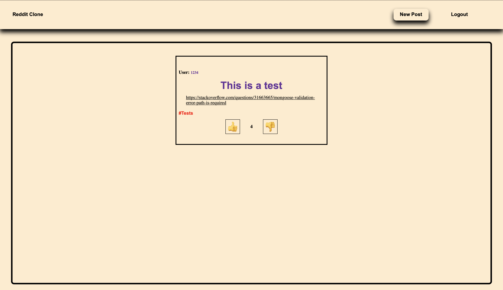
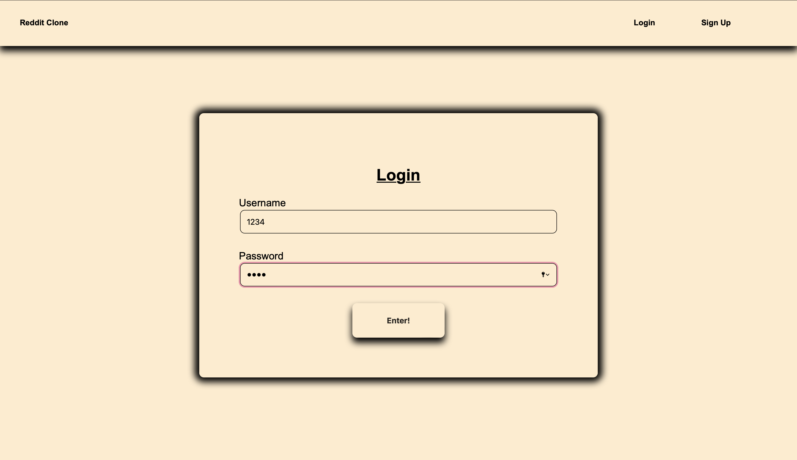
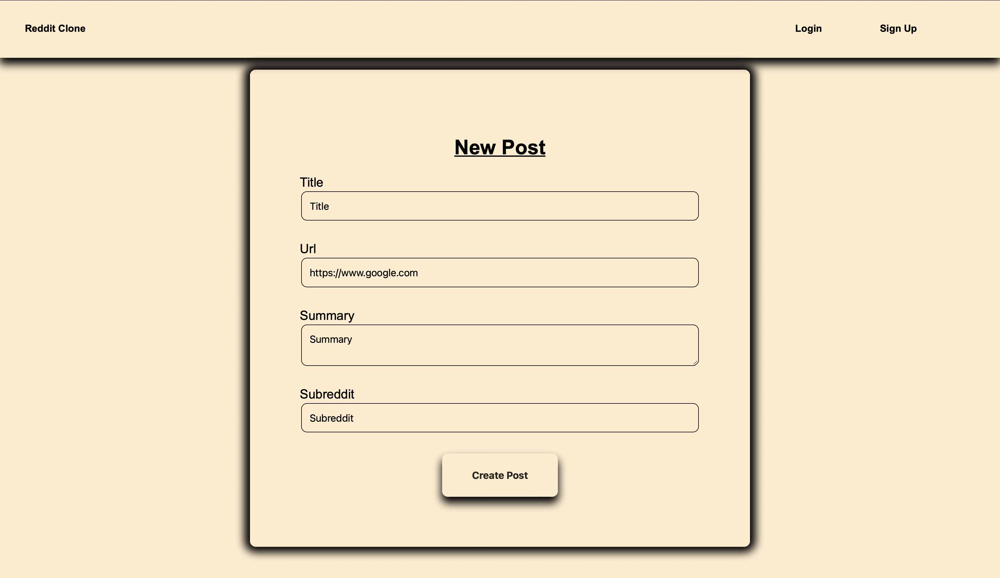
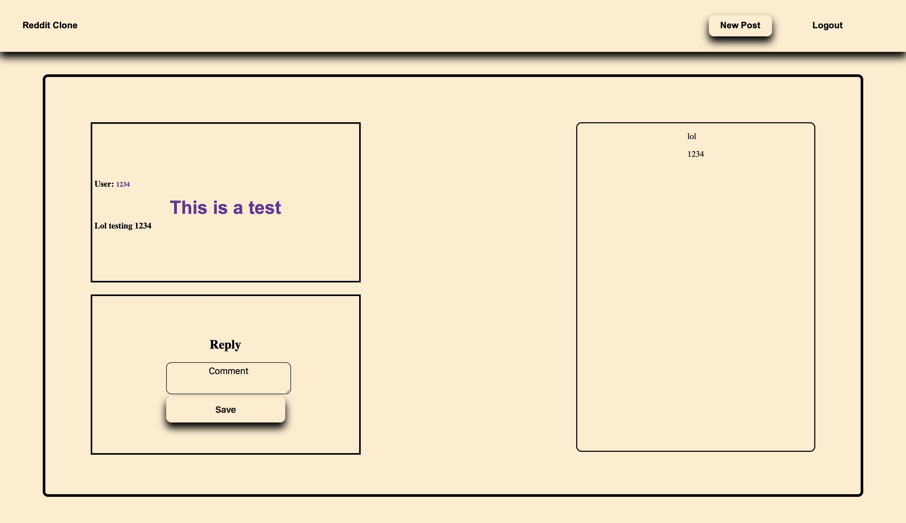

# Reddit Clone App

## Built With

- [HTML](https://en.wikipedia.org/wiki/HTML)
- [Node](https://nodejs.org/en/)
- [Handlebars](https://handlebarsjs.com)
- [Bootstrap](https://getbootstrap.com)
- CSS
